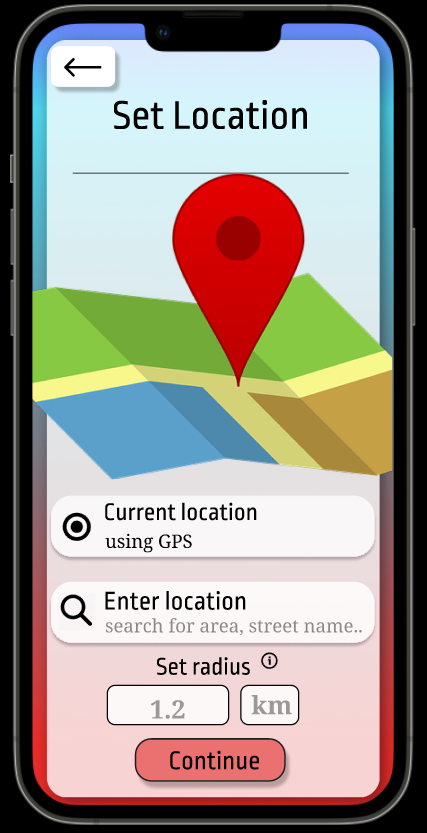

# Lessgo

An outdoor activity planner app design.\
Lessgo lets people **create and join invites** in their area making outdoor activities more accessible and fun. It has an **interactive user interface** and the potential to tackle grave socio-health problems.
The project follows the key aspects of designing any app.

## Project Overview

Elaborate explanation of each step is provided in the latex documentation.
Links have been provided to sites where prototypes and other elements were originally designed.

- **Problem Identification**
    - Background
    - Problem Definiton
    - Existing Challenges
    - Existing Solutions
    - Proposed Solution

- **Methodology**
    - Problem Statement
    - Stakeholders
    - Survey Analysis
    - Interviews
    - Indentifying Mistakes

- **Ideation**
    - Possible Solutions
    - Feasible Solutions

- [**Mind Map**](https://miro.com/app/board/uXjVOI46eFo=/)
- [**Storyboard** ](https://drive.google.com/drive/folders/1AbM9yxGmV8Uu7rKHNGmm5E5BlinwyjIq)

- [**Low Fidelity Prototype** ](https://drive.google.com/drive/folders/15ufw3dfdPEFSICRyW-BpFv7ZtV74LiXy?usp=sharing)

- [**High Fidelity Prototype**](https://www.figma.com/proto/o7fpp9c7XiyfBgPxudSmoa/Lessgo?node-id=486%3A932&scaling=scale-down&page-id=0%3A1&starting-point-node-id=486%3A952)

- **Evaluation**
    - Plan
    - Interviews
    - Suggestions

- **Iterative Improvements**

- **Limitations and Development Possibilities**
- [**Presentation**](https://www.canva.com/design/DAE975nzPy8/QLzmMr3nzz_XdQnPCRjbIQ/edit?utm_content=DAE975nzPy8&utm_campaign=designshare&utm_medium=link2&utm_source=sharebutton)
- [**Video**](https://drive.google.com/drive/folders/1pZzAzGfEJcUi6XqfVmAhdMVfAPTeHpWp?usp=sharing)

## Authors

- [@Lakshya Goel](https://www.github.com/octokatherine)
- [@Udit Kumar](https://www.github.com/octokatherine)
- [@Ritwik Kashyap](https://www.github.com/octokatherine)
- [@Prateek Kumar](https://www.github.com/octokatherine)
- [@Saurabh Kumar](https://www.github.com/octokatherine)

